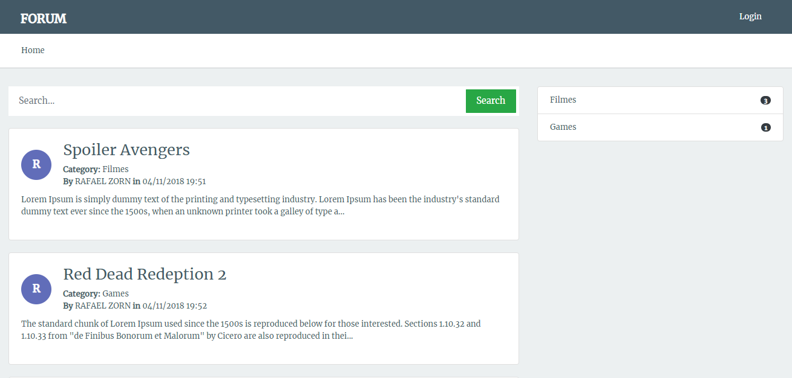
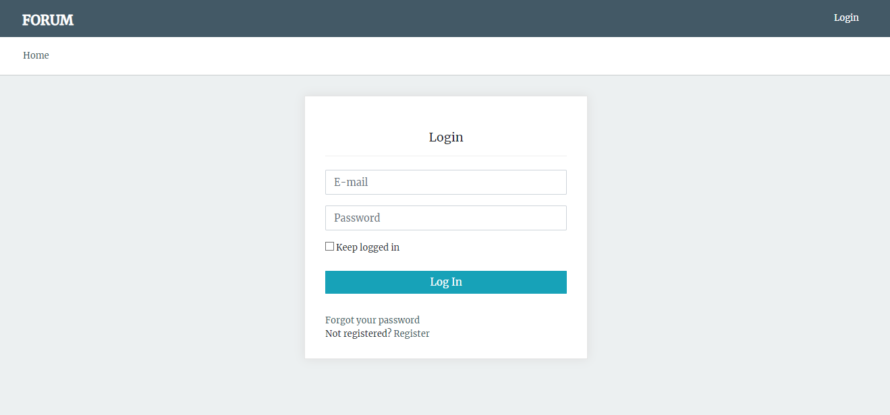
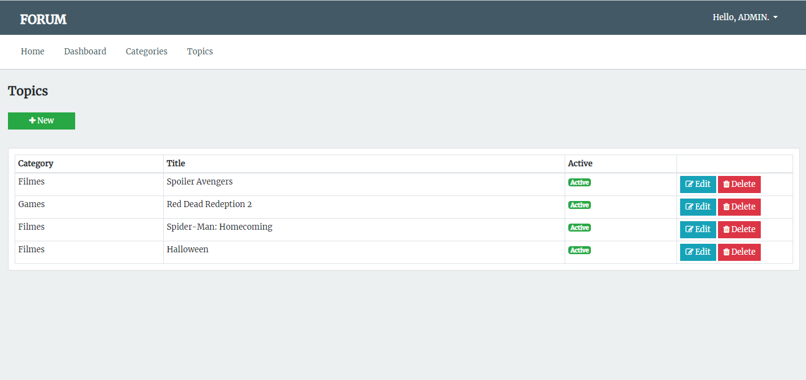

[]

   <h3 align="center">Forum</h3>

---

## Overview

Project for study of TDD using Laravel framework. 

## Preview

## Running the project

- Clone this repository
- Install all dependencies using the command `composer install`
- Fill the `.env` file
- Generate key `php artisan key:generate`
- Execute migrations `php artisan migrate`
- Execute seeders `php artisan db:seed`
- Execute tests `phpunit`

## Used technologies

- Laravel 5.6
